# EduROOM: Classroom Reservation System  
*A Final Project — Built with Python, Flet, MySQL, and WebSockets*

## Courses Covered
- **CCCS 106** – Application Development and Emerging Technologies  
- **CS 319** – Information Assurance and Security  
- **CS 3110** – Software Engineering 1  

## Developed by: **TechValks**

### **Team Roles**
- **Full-Stack Developer & Lead Backend Engineer:** Blessie Faith Bongalos  
- **UI/UX Designer & Lead Frontend Engineer:** Tischia Ann Olivares  
- **Documentation Managers:** Ivy Doroin, Renna Israel  

---

**BSCS 3A — Camarines Sur Polytechnic Colleges**


# Project Overview

**EduROOM** is a cross-platform classroom reservation and scheduling system designed for **Academic Building IV of CSPC**.  
It replaces manual reservation workflows with a secure, automated, real-time platform.

The system provides:

- Real-time room availability  
- Faculty reservation submission  
- Administrative approval dashboard  
- User account management  
- Activity logging and analytics  
- Secure authentication and session controls  
- WebSocket-based real-time updates  

Developed using **Python + Flet**, **MySQL**, and **WebSockets**.

---

# Key Features (Aligned with SRS)

## 1. User Authentication & Security
- Secure login using CSPC email + ID  
- Password hashing using **bcrypt**  
- **Login lockout** after 5 failed attempts (10 min window)  
- **Session management & inactivity timeout**  
  - Auto-logout after idle period  
  - Session expiration notice  
  - Activity tracking via `last_activity`  
- **CSRF-style per-session action token**  
- Clean session clearing upon logout  

---

## 2. Role-Based Access Control (RBAC)
| Role | Capabilities |
|------|--------------|
| **Student** | View room availability only |
| **Faculty** | View rooms + submit reservations + view history |
| **Admin** | Approve/reject requests, manage users, manage schedules, view analytics, view logs |

RBAC enforced at both **UI level** and **application logic**.

---

## 3. Reservation Management
- Room search and availability viewing  
- Conflict detection via academic schedules  
- Reservation creation for faculty  
- Admin approval or rejection with remarks  
- Real-time UI updates  
- Reservation history per user  

---

## 4. Real-Time Features (Emerging Tech)
- WebSocket server for push notifications  
- Live updates for:
  - New reservations  
  - Approval/rejection  
  - Analytics refresh  
- Delivery typically < 100 ms  

---

## 5. Profile Management
- View profile information  
- Change password with old-password verification  
- Profile picture support  

---

## 6. Admin User Management
Admins can:  
- Create user accounts  
- Edit user details  
- Change roles  
- Disable/activate accounts  
- Reset passwords  
- Delete accounts  
- View activity logs  
- Access analytics dashboard  

---

## 7. Activity Logging
The system automatically logs critical events:

- Login success/failure  
- Account lockouts  
- User creation, updates, deletions  
- Role changes  
- Password resets  
- Reservation approvals/rejections  

---

## 8. Analytics Dashboard
Admins can view comprehensive data visualizations and insights:
- Status metrics (total, approved, pending, rejected)
- Weekly trends with percentage comparisons
- Peak usage hours and daily averages
- Most popular classrooms and active faculty
- Room utilization rates and recommendations
- Real-time updates via WebSocket

---

# System Architecture

EduROOM follows a modular, layered architecture:

### **1. Presentation Layer**
- Flet UI components  
- Page views and navigation  

### **2. Application Layer**
- Reservation logic  
- User management  
- Session validation  
- Input validation  

### **3. Data Layer**
- MySQL database  
- Model classes for core entities  
- Parameterized SQL queries  

### **4. Realtime Communication Layer**
- WebSocket server for notifications  

### **5. Security Layer**
- Authentication  
- Password hashing  
- Session timeout  
- Action tokens  
- Login lockout  

---

# Database Model (ERD)

The EduROOM database consists of five core entities: **Users**, **Classrooms**, **Reservations**, **Notifications**, and **Activity Logs**.  
Users can create reservations for classrooms, receive notifications about their requests, and generate activity logs based on system actions. Classrooms can have multiple reservations, and each reservation may trigger related notifications. This structure supports secure authentication, room scheduling, and real-time system updates.


*(Insert ERD image in your repo and update the path below)*

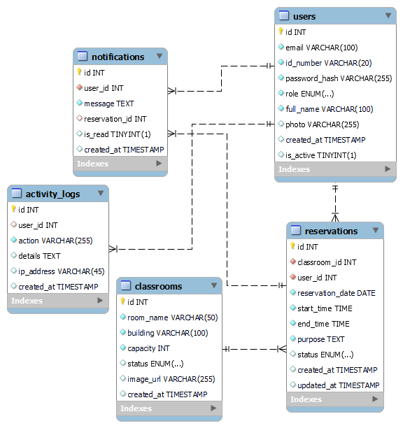

## Installation & Setup

### 1. Clone the repository
```sh
git clone https://github.com/yourusername/EduRoom.git
cd EduRoom

```
### **2. Create & activate virtual environment**
```sh
python -m venv .venv
.venv\Scripts\activate      # Windows
source .venv/bin/activate   # macOS / Linux

```
### **3. Install dependencies**
```sh
pip install -r requirements.txt

```
### **4. Import database schema**
  
Import eduroom_schema.sql into MySQL.

### **5. Configure environment variables**

Create a .env file:
```sh
DB_HOST=localhost
DB_USER=root
DB_PASS=yourpassword
DB_NAME=eduroom

```
**Running the Application**
```sh
python main.py

```

The system will launch in a Flet window or your default browser.

**Running Tests**
```sh
python tests/run_tests.py
python tests/test_auth.py
python tests/test_analytics.py
python tests/test_validation.py

```

✔ ALL TESTS PASSED!

# Real-Time WebSocket Setup & Testing

EduROOM uses a dedicated **WebSocket server** to provide real-time updates for:

- New reservation requests  
- Admin approvals and rejections  
- Live analytics dashboard updates  
- User notifications  

This integration fulfills the system’s **Emerging Technology Requirement**.

---

## 1. Start the WebSocket Server

In a separate terminal window, run:

python websocket_server.py


**Expected output:**
WebSocket server started on ws://localhost:8765
Waiting for clients...


> The WebSocket server must remain running for real-time updates to function properly.

---

## 2. Launch the Main Application

Open another terminal window and run:

python main.py


**When the client connects successfully, the WebSocket server displays:**
Client connected: 127.0.0.1


---

## 3. Testing Real-Time Features

### ✔ Test A — New Reservation Appears Instantly on Admin Dashboard

1. Log in as **Faculty**.  
2. Submit a new reservation request.  
3. Log in as **Admin** in another application window.  
4. The new request should appear instantly (within <100 ms) **without refreshing**.

**WebSocket server output:**
Broadcasting message: new_reservation


**Admin client output:**
Received message: new_reservation

---

### ✔ Test B — Admin Approval/Rejection Notifies Faculty Immediately

1. Admin approves or rejects the reservation.  
2. Faculty receives a **real-time notification** in the UI.

**WebSocket server output:**
Broadcasting message: reservation_update

**Faculty client output:**
Received message: reservation_update


---

### ✔ Test C — Analytics Dashboard Auto-Refresh

1. Open the **Analytics Dashboard** as Admin.  
2. Trigger reservation changes from a Faculty account.  
3. The analytics dashboard automatically refreshes **without reloading** the page.

---

## 4. Expected Performance

| Metric | Target Performance |
|--------|--------------------|
| Local WebSocket message delay | 10–50 ms |
| Guaranteed max delay | <500 ms |

EduROOM’s WebSocket system ensures **true real-time responsiveness**, meeting all **SRS performance requirements**.

---

## 5. Troubleshooting

| Issue | Solution |
|-------|-----------|
| No real-time updates | Ensure `websocket_server.py` is running |
| Connection refused | Check that port `8765` is free |
| No client connection | Verify the WebSocket URL: `ws://localhost:8765` |
| Updates delayed | Restart both the WebSocket server and the app |
| Two users not syncing | Restart each app window to reconnect clients |

---

# User Manual
This section guides CSPC **Students**, **Faculty**, and **Admins** on how to use the EduROOM Classroom Reservation System.

## 1. Login & User Accounts

### How to Log In
1. Open the EduROOM application.
2. Enter your **CSPC email** and **ID number**.
3. Enter your password and click **Login**.

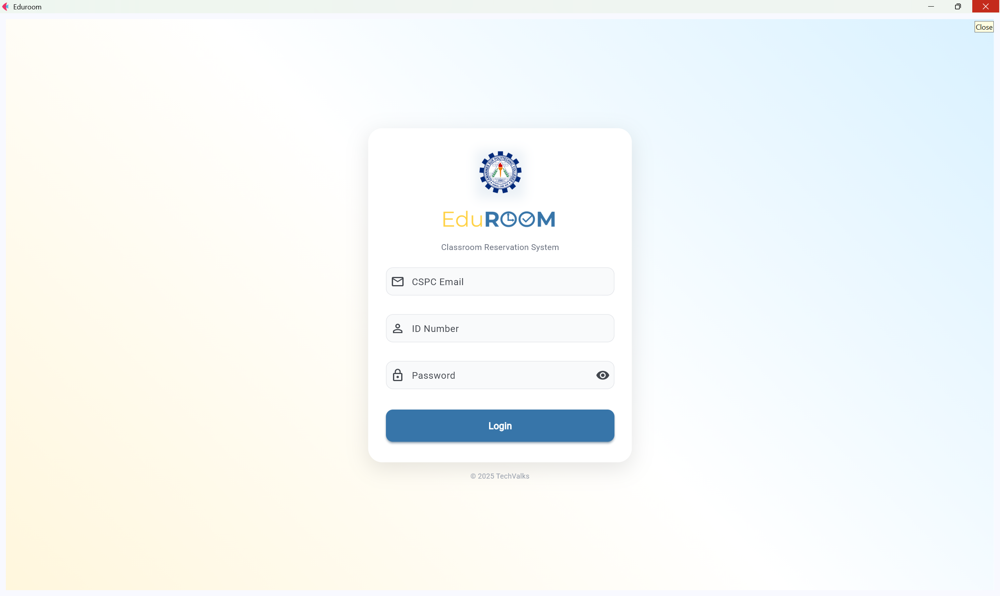

## 2. Student User Guide

Students have view-only access. They cannot create reservations.
Their main purpose is to check real-time classroom availability.

### 2.1 Accessing the Classrooms Page

Once logged in, the system automatically opens the Classrooms page.
This page displays all rooms in Academic Building IV, including their availability status.

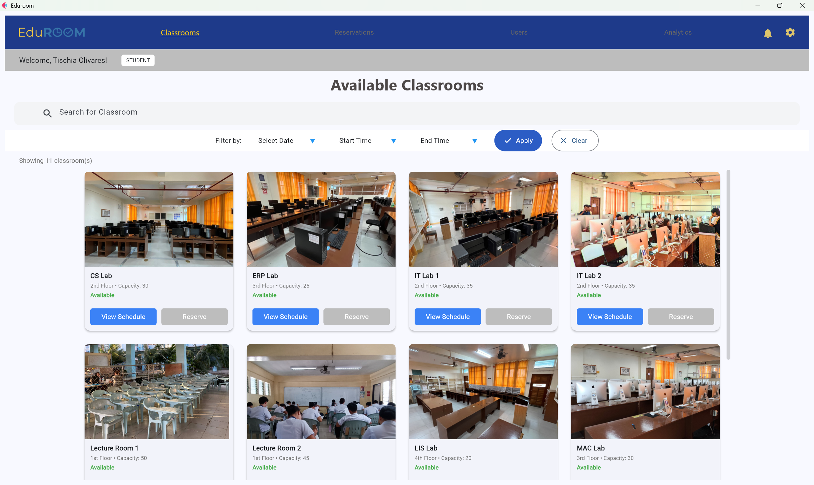

### 2.2 View Room Schedule

To see confirmed reservations for a specific classroom, click on the **View Schedule** button of a classroom.

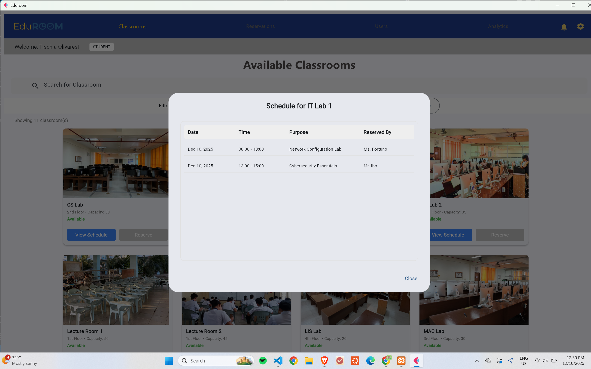

### 2.3 Searching for Classrooms

Students can quickly find a room using the built-in search bar. Go to the Search field at the top of the Classrooms page and type keywords related to the room.

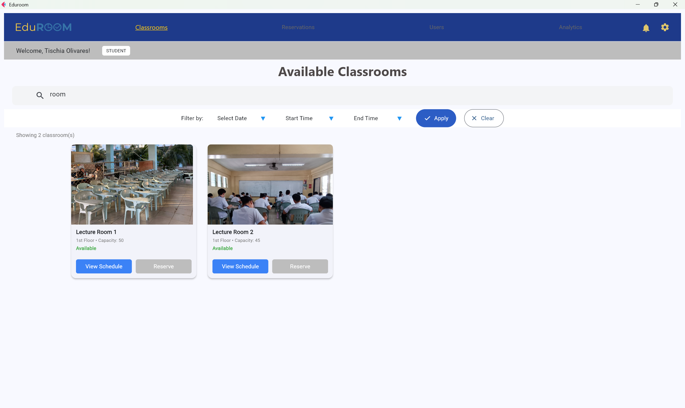

### 2.4 Filtering Rooms

Students can filter classroom results using the **Select Date**, **Start Time**, and **End Time** filters.

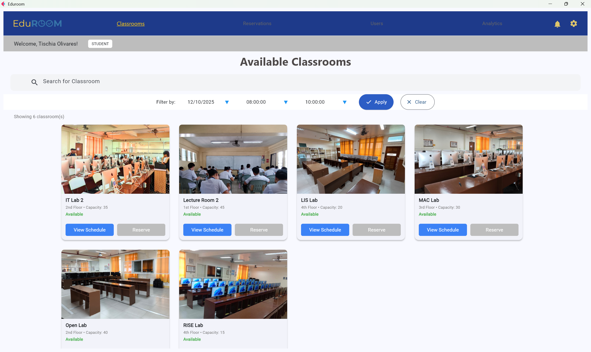

## 2.5 Settings & Account Management

### Accessing Settings
1. Click on the settings icon in the top-right corner to open the settings drawer, which displays options for **Profile**, **Dark Mode** , and **Logout**.

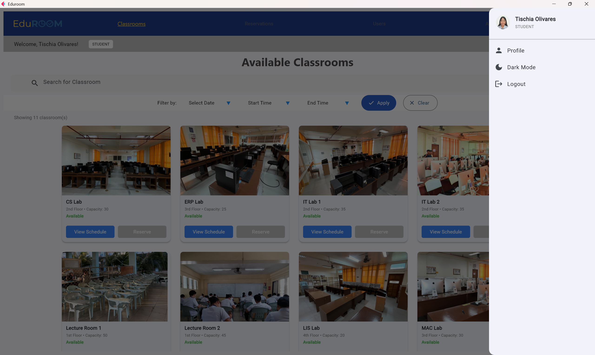

### View Your Profile
Select **Profile** to view your account details (Name, Email, ID, Role). You can also change your profile picture by clicking **Upload New Picture**.

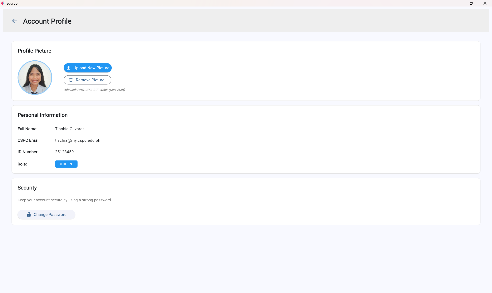

### Change Your Password
From your profile page, click **Change Password**, then enter your current password, new password, and confirm the new password before clicking **Update Password**.

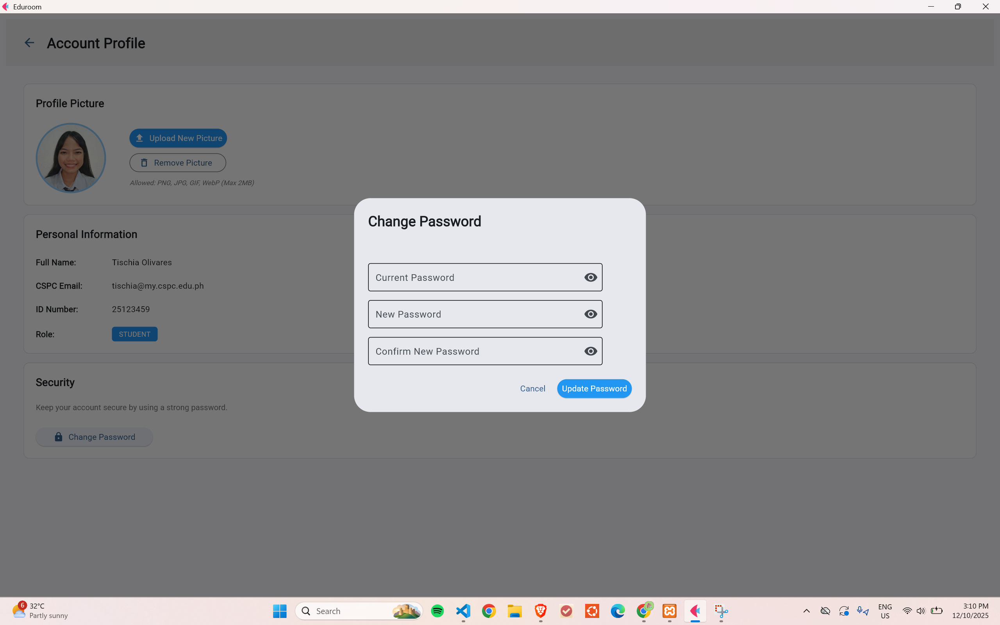


## 3. Faculty User Guide

Faculty members have access to all student features, plus the ability to **create classroom reservations** and **manage their reservations**.

### 3.1 Viewing Classrooms

Faculty can access the same classroom viewing features as students. But unlike students, faculty members have an **enabled "Reserve" button** for each classroom, allowing them to submit reservation requests.

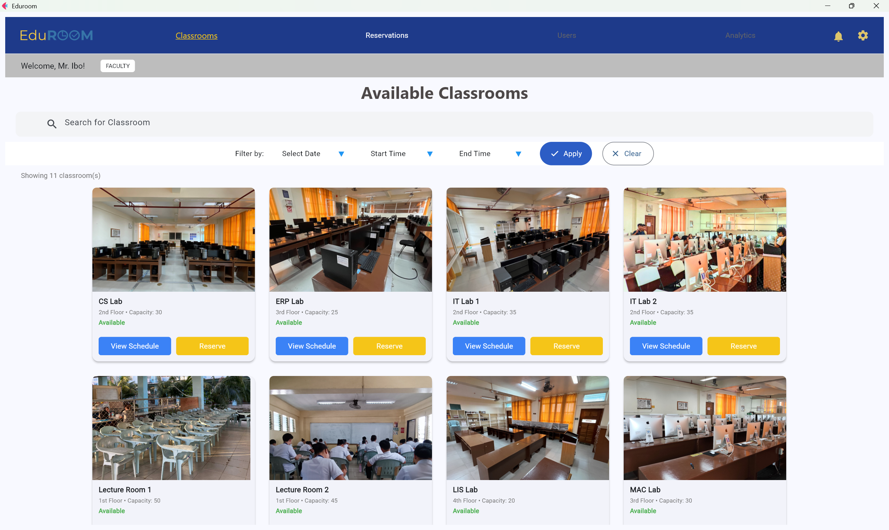

### 3.2 Creating a Reservation

#### Step 1: Navigate to the Classrooms Page
From your dashboard, you will see all available classrooms.

#### Step 2: Select a Classroom
Click on the classroom you want to reserve.

#### Step 3: Fill Out the Reservation Form
Provide the following information: Date, Start Time, End Time, and Purpose of reservation.

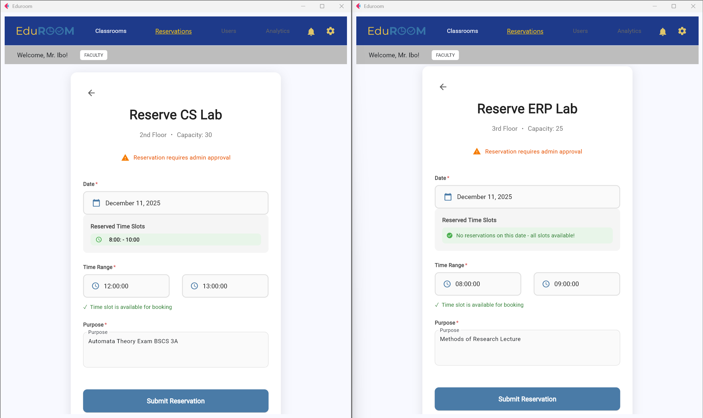

When you select a date, the system automatically displays all **reserved time slots** for that day. You cannot select time periods that are already booked.

#### Step 4: Submit Your Request
Click the **Submit Reservation** button.

#### Step 5: Wait for Admin Approval
Your reservation will be marked as **Pending** until an admin reviews and approves it.

## 3.3 Managing My Reservations
Faculty can view and track all their reservation requests.

### Accessing Your Reservations
1. Click on **My Reservations** from the navigation menu.
2. You will see a list of all your reservation requests organized into two tabs:
   - **Upcoming**: Future reservations you can still manage
   - **Past**: Historical reservation records


### Managing Upcoming Reservations
You can edit or cancel reservations that are still pending or upcoming. Past reservations cannot be modified

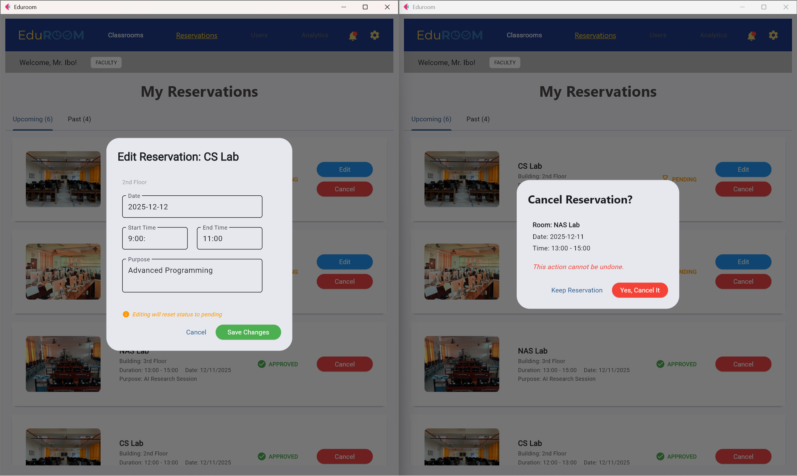

### 3.4 Real-Time Notifications

Faculty receive **instant notifications** when their reservations are:
- Approved by an admin
- Rejected by an admin

These updates appear automatically without needing to refresh the page.

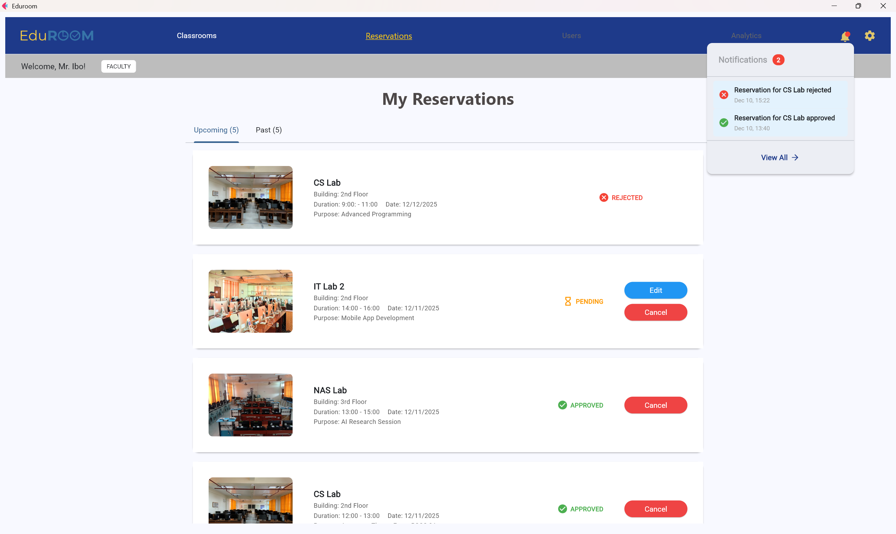

---

## 4. Administrator User Guide

Admins have full control over all reservation requests submitted by faculty members.  
The **Manage Reservations** interface organizes requests into five tabs for streamlined review.

### **Reservation Tabs Overview**

| Tab | Description |
|------|-------------|
| **Pending** | New requests waiting for admin action |
| **Approved** | Confirmed reservations |
| **Ongoing** | Reservations currently in progress |
| **Done** | Completed reservations |
| **Rejected** | Requests denied by admin |

---

### **Viewing Reservation Details**

1. Choose a tab (e.g., **Pending**)  
2. On the reservations card, you will see the following information:  
   - Room  
   - Faculty requester  
   - Date and time  
   - Purpose  


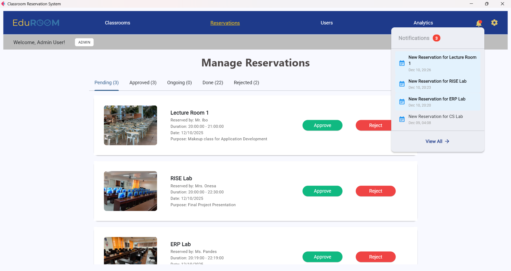

  #### **Approving or Rejecting a Reservation**
  
  Upon approval or rejection:

  - The reservation moves automatically to its respective tab  
  - Faculty notifications appear instantly  
  - The dashboard analytics update without refreshing the page  
  - The faculty member receives **real-time notification** via WebSockets


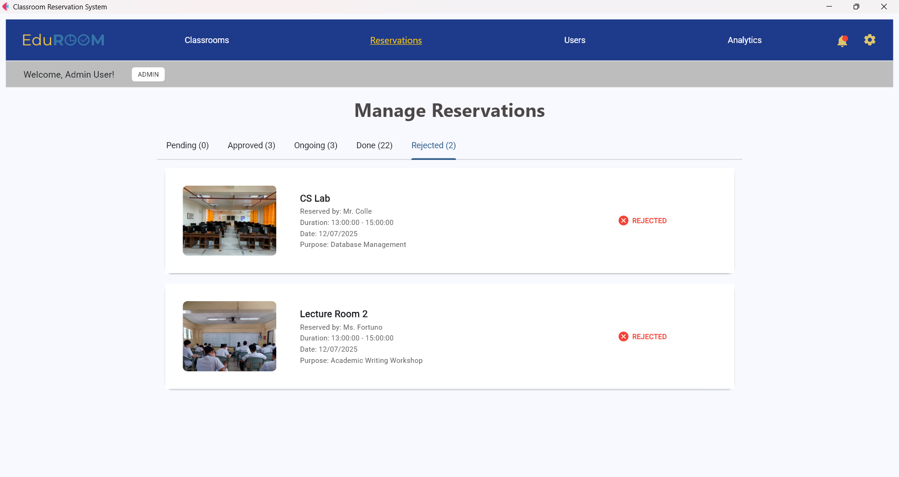


---

### **Tracking Ongoing and Completed Reservations**

Admins can monitor rooms currently in use:

- **Ongoing** tab → Shows active reservations for the current day and time
- **Done** tab → Shows all past reservations for record-tracking. 

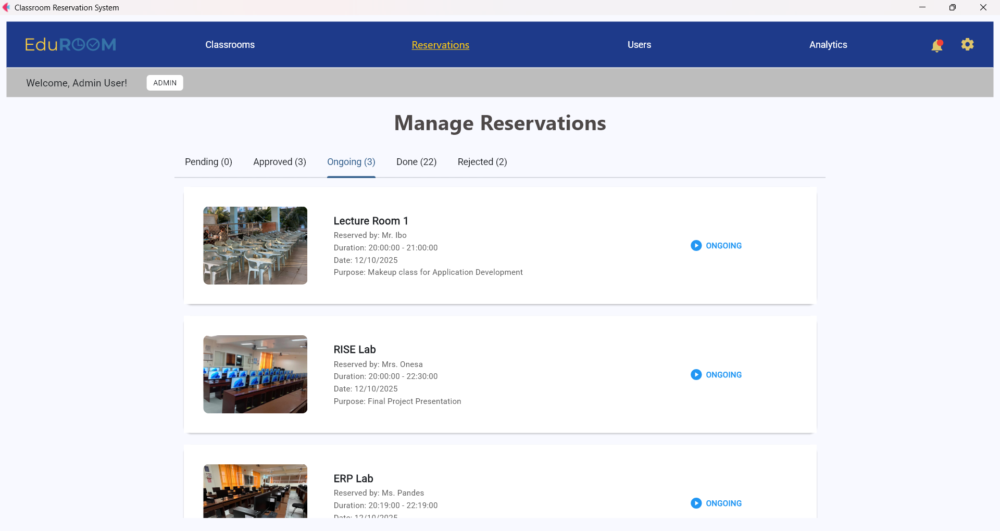

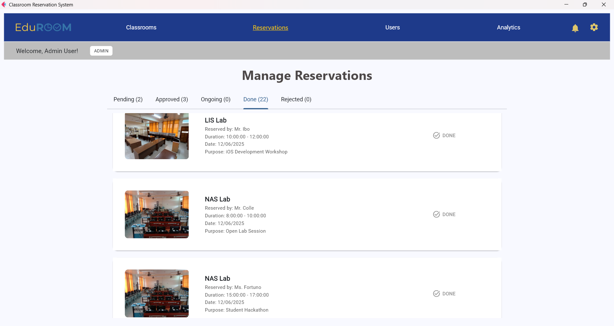

---

## 4.1 User Management (Admin)

The **User Management** module allows admins to create, modify, activate/deactivate, and delete user accounts.

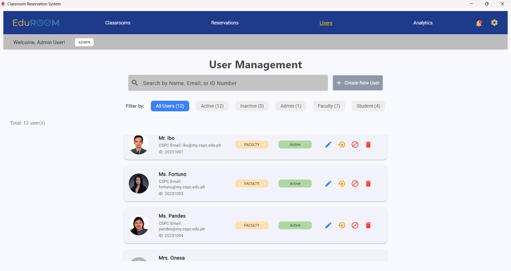

### **User Management Features**

| Feature | Description |
|---------|-------------|
| **Search Users** | Search by name, email, or ID number |
| **Filter Users** | Filter by Active, Inactive, Admin, Faculty, Student |
| **Create User** | Add new users with assigned roles |
| **Edit User** | Update email, role, ID number, profile picture |
| **Activate/Deactivate** | Temporarily disable users without deleting them |
| **Reset Password** | Instantly assign a new password for account recovery |
| **Delete Account** | Permanently remove a user |

---

### **Creating a New User**

1. Click **+ Create New User**  
2. Fill in user details:  
   - Full Name  
   - Email  
   - ID Number  
   - Role (Admin, Faculty, Student)  
   - Initial Password  
3. Click **Create User** to save

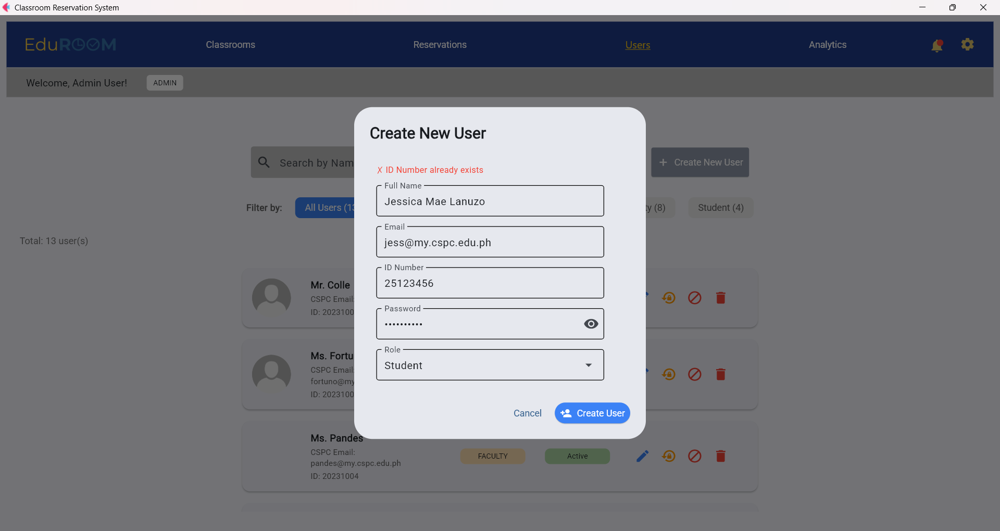


---

## 4.2 Admin Analytics Dashboard

The **EduROOM Analytics Dashboard** provides administrators with real-time insights into reservation activity, classroom usage, and user behavior.  
Only **Admin** accounts have access to this module.

To access the analytics, click **Analytics** from the navigation bar.


### Real-Time Analytics Updates

EduROOM integrates WebSocket technology to deliver **live data updates**.  
Whenever a reservation is created, approved, rejected, or completed:

✔ The analytics panel refreshes automatically  
✔ No page reload is required  
✔ Admin dashboards always show the latest numbers  

This ensures real-time accuracy for tracking classroom usage.

---
## 4.2.1 Status Metrics

These cards show the current total count of each reservation status:

- **Total Reservations**
- **Approved**
- **Pending**
- **Rejected**

Each card updates automatically when:
- A faculty submits a reservation  
- An admin approves or rejects a request  
- A reservation becomes ongoing or done  

---

## 4.2.2 Weekly Reservation Trends

This section compares booking activity between:

- **This Week**
- **Last Week**


The bar chart and counts show:
- Weekly volume changes  
- Growth percentage  
- Reservation streaks  
- Sudden increases/decreases in usage  

This helps admins detect patterns and plan room availability.

---

## 4.2.3 Peak Hour, Daily Average, and Popular Room

EduROOM provides automated insights such as:

- **Peak Hour** – the time slot with the highest booking activity  
- **Daily Average** – average reservations per day over 30 days  
- **Most Popular Room** – the most requested classroom  

This helps admins:
- Identify periods of high system usage  
- Optimize classroom schedules  
- Allocate support resources strategically  

---
## 4.2.4 Status Distribution Table

This table breaks down how many reservations fall under each status category:

| Status | Count | Percentage |
|--------|--------|--------------|

Statuses include:
- **Approved**
- **Rejected**
- **Ongoing**
- **Done**

The percentage chart updates **in real time**.
---
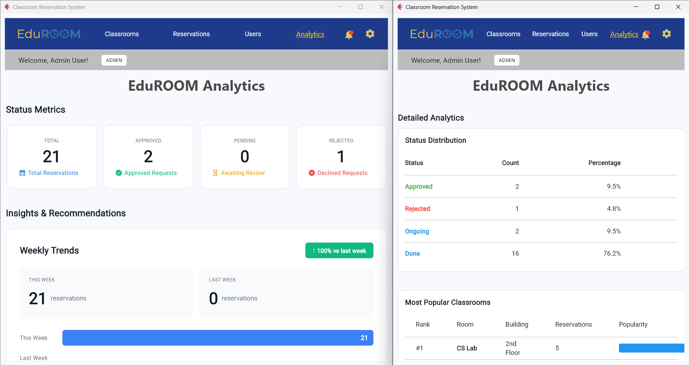
---


## 4.2.5 Most Popular Classrooms

A ranking table showing rooms with the highest usage.

Includes:
- Room name  
- Building  
- Number of reservations  
- Popularity bar indicator  

Used for:
- Identifying rooms in high demand  
- Detecting underutilized spaces  
- Making recommendations for classroom improvements  

---
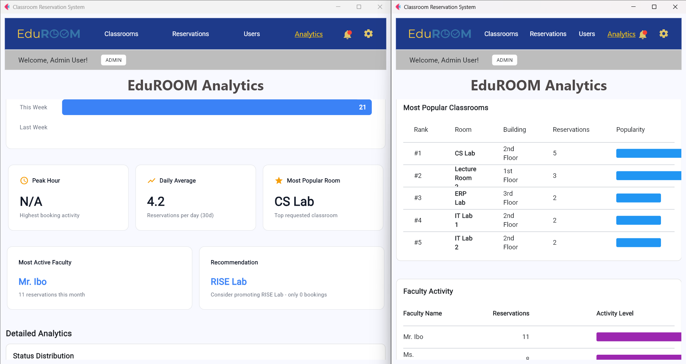
---

## 4.2.6 Faculty Activity Tracker

This section shows which faculty members make the most reservations.

Metrics provided:
- Total reservations made by each faculty  
- Activity level comparisons  
- Identification of power users  

---

## 4.2.7 Recent Trends (Last 10 Days)

A daily breakdown of reservation counts and charted activity volume.


This helps admins quickly spot:
- Sudden surges in reservations  
- Quiet days  
- Seasonal patterns (e.g., exam week, events)  

---

## 4.2.8 Classroom Utilization Table

This section lists each classroom and its usage statistics:

- Room name  
- Building  
- Total reservations  
- Approved reservations  

Useful for:
- Identifying underused classrooms  
- Planning maintenance and scheduling  
- Decision-making for future facility improvements  

---
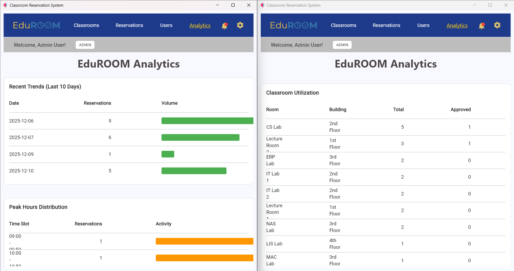
---

## ✔ Summary: Why Admin Analytics Matters

The Analytics module empowers CSPC administrators to:

| Benefit | Explanation |
|---------|-------------|
| **Real-time monitoring** | Live updates via WebSockets |
| **Better decision-making** | Trends, peak hours, popular rooms |
| **Resource optimization** | Utilization rates guide scheduling |
| **User behavior insights** | Faculty activity and request patterns |
| **Operational transparency** | Clear breakdown of reservation statuses |

---

## ✔ Summary: Admin Tools Overview

Admins can perform:

- Full reservation workflow oversight  
- User lifecycle management  
- Real-time response monitoring  
- System usage analytics  
- Account and profile updates  

Making EduROOM a complete facility management tool tailored for CSPC.

---


